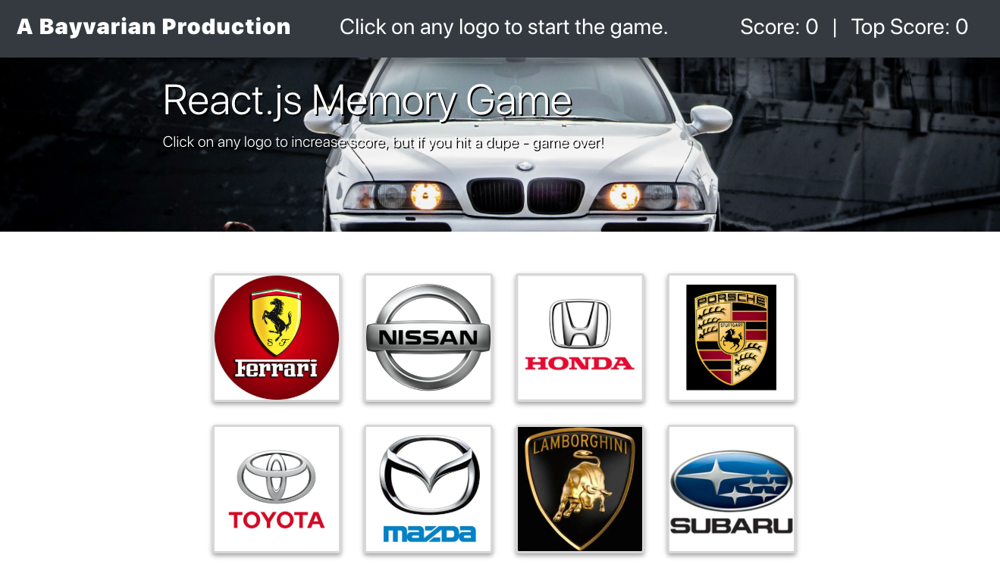

# HW14 | React.js Clicky Game

## Link to Live Deployed Page on Github Pages
[Github Pages Deployed App](https://bavarianstance.github.io/hw14-clicky-game/)

## Installation/Usage
* npm-install for initial download of dependent packages
* npm start to init server
* navigate to localhost:3000 in web browser to launch app

### App Screenshots
* Main Page

### Technologies Used
* Node.JS 
* Express
* React
* Javascript ES6
* jQuery
* Bootstrap

### Comments
* Added CSS animations for correct/incorrect guesses.
* main app logic is in app.js